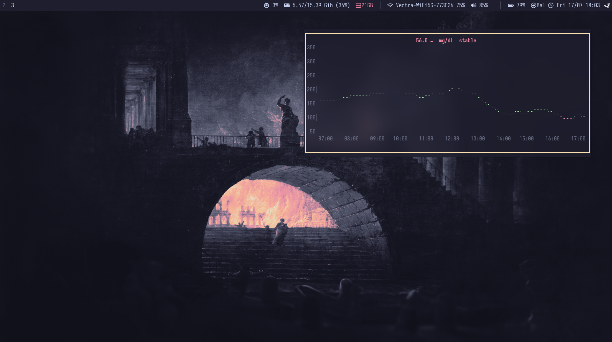
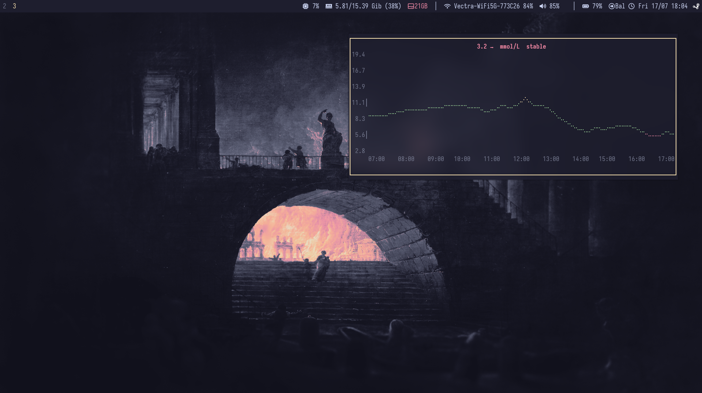
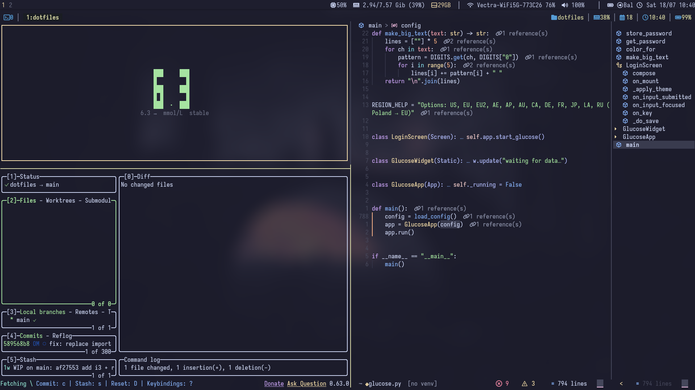
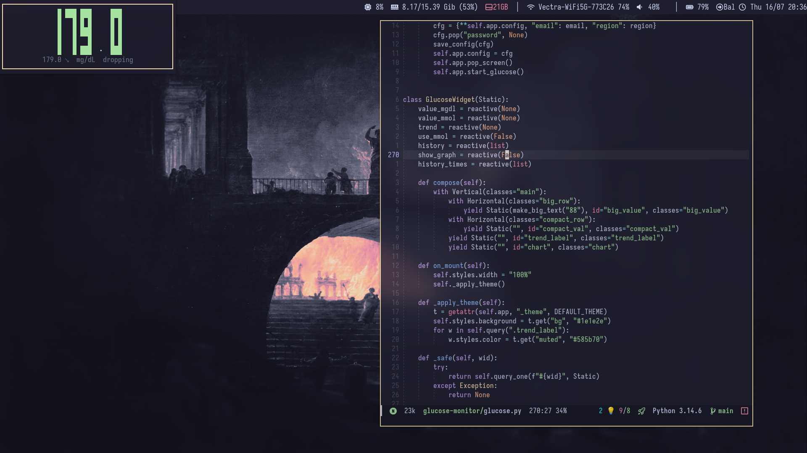
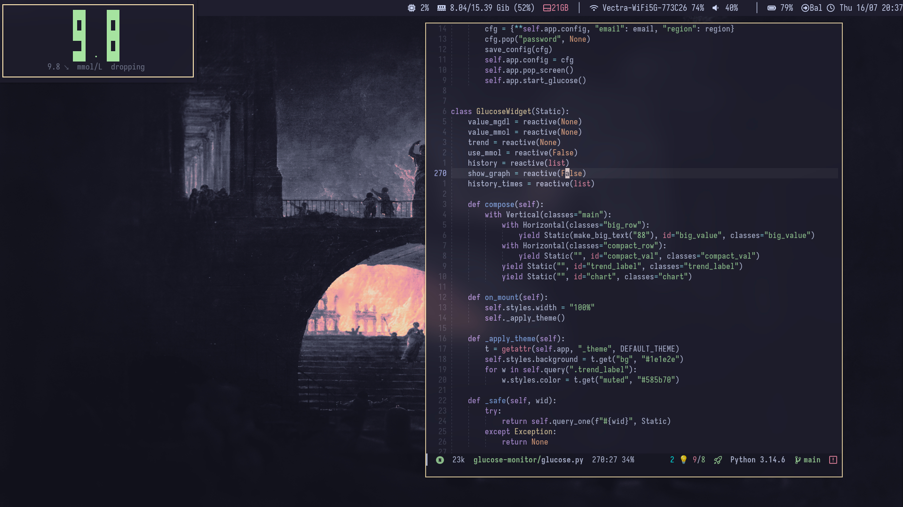
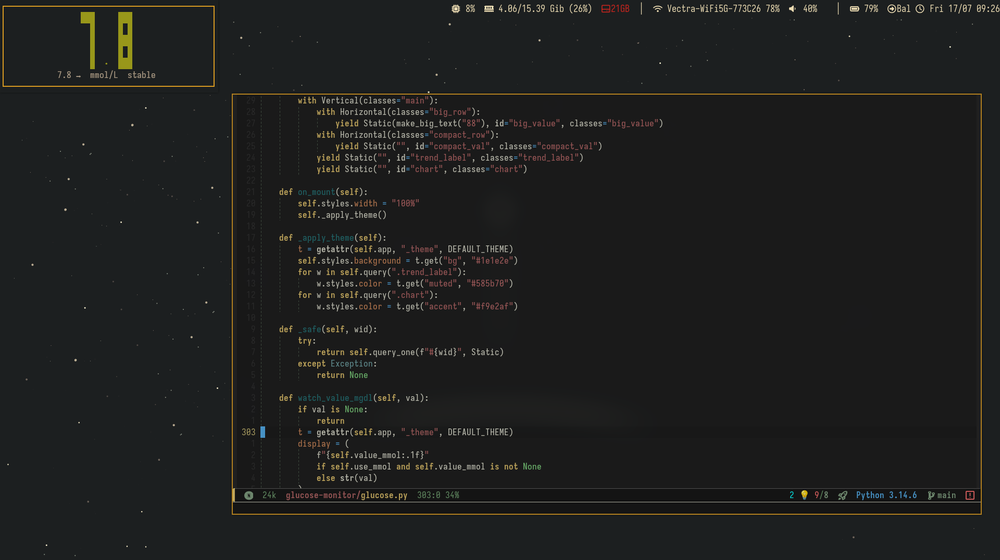
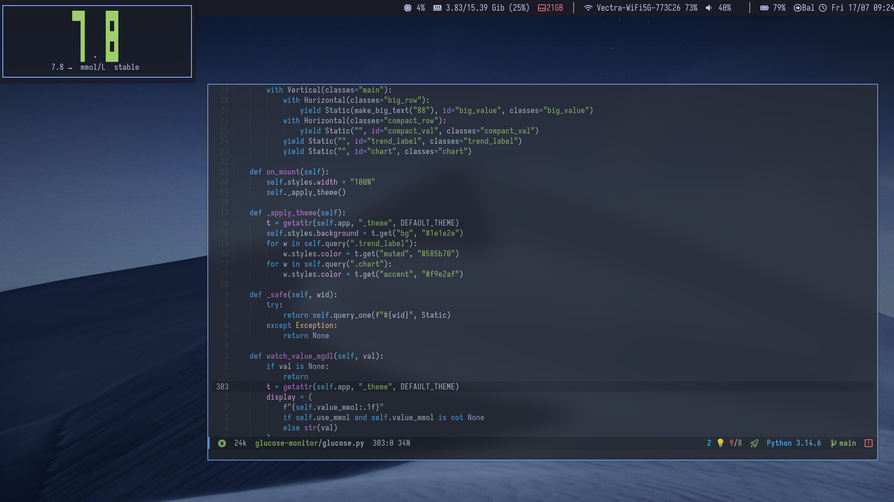
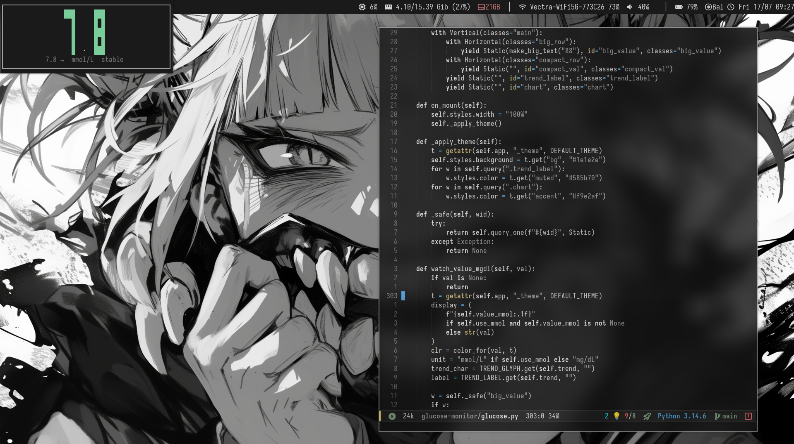

# Floating Glucose Monitor

<p align="center">
  A clean floating terminal interface for viewing live FreeStyle LibreLinkUp glucose readings on Linux.
</p>

<p align="center">
  
</p>

<p align="center">
  
</p>

<p align="center">
  
</p>

> It's also fully usable inside tmux and other terminal multiplexers — no floating window required.

<p align="center">
  
</p>

<p align="center">
  
</p>

<p align="center">
  
</p>

<p align="center">
  
</p>

<p align="center">
  
</p>

<p align="center">
  <strong>Live readings · Trend indicators · Glucose history · mg/dL and mmol/L</strong>
</p>

---

## Overview

**Floating Glucose Monitor** is a lightweight floating-window TUI for displaying live FreeStyle LibreLinkUp glucose readings.

It is designed primarily for Linux desktops running i3wm and uses:

* [Textual](https://textual.textualize.io/) for the terminal interface
* [pylibrelinkup](https://github.com/ivallesp/pylibrelinkup) for LibreLinkUp data
* `kitty` for the floating terminal window
* The system keyring for secure password storage

> This is an unofficial community/personal project and is not affiliated with Abbott or FreeStyle Libre.

## Features

* Large, easy-to-read glucose display
* Glucose trend arrows: `↑` `↗` `→` `↘` `↓`
* Color-coded glucose values

  * Green for values in range
  * Red for low values
  * Orange for high values
* Recent glucose history graph
* Toggle between `mg/dL` and `mmol/L`
* Automatic glucose refresh
* Less-frequent history refresh to reduce API usage
* LibreLinkUp region selection
* Catppuccin Mocha-inspired interface
* Password storage through the operating system keyring
* Floating-window integration for i3wm

## Requirements

* **Python 3.10+** — tested on 3.11 and 3.12
* **A LibreLinkUp account** — [create one free](https://www.libreview.com/) and have a FreeStyle Libre user share their data with it
* **Linux** — developed and tested on Arch Linux; should work on any distro
* **(Optional) i3wm** — for the floating-window toggle; adaptable to other WMs
* **(Optional) kitty** — the toggle script uses kitty; easy to swap out
* **A system keyring backend** — `gnome-keyring`, `kwallet`, or `secret-service` (typically already present on a desktop Linux install)

## Installation

### 1. Clone and set up

```bash
git clone https://github.com/DevDad-Main/FloatingGlucoseMonitor.git
cd FloatingGlucoseMonitor
python3 -m venv venv
source venv/bin/activate
pip install textual pylibrelinkup keyring requests
chmod +x run.sh toggle.sh diagnose.sh
```

### 2. First launch

```bash
./run.sh
```

On first launch you'll be prompted to enter:
* Your LibreLinkUp email
* Your LibreLinkUp password
* Your API region (see [Regions](#regions) below)

Your password is stored in the system keyring, never in a config file.

### 3. Floating-window toggle (i3wm)

For the `$mod+Shift+g` toggle, add to your i3 config:

```text
bindsym $mod+Shift+g exec --no-startup-id /path/to/FloatingGlucoseMonitor/toggle.sh
```

Then reload i3: `$mod+Shift+r`.

Add a `for_window` rule to size it as a compact widget:

```text
for_window [instance="glucose-monitor"] floating enable, border none, resize set 419 178, move position 1650 80
```

Adjust the `move position` coordinates for your monitor layout.

### Regions

| Region | API URL |
| ------ | ------- |
| US     | `api-us.libreview.io` |
| EU     | `api-eu.libreview.io` |
| AU     | `api-au.libreview.io` |
| AP     | `api-ap.libreview.io` |
| CA     | `api-ca.libreview.io` |
| DE     | `api-de.libreview.io` |
| FR     | `api-fr.libreview.io` |
| JP     | `api-jp.libreview.io` |
| LA     | `api-la.libreview.io` |

Run `./diagnose.sh` to test connectivity with your region.

## Controls

| Key | Action                           |
| :-: | -------------------------------- |
| `u` | Toggle between mg/dL and mmol/L  |
| `g` | Toggle the glucose history graph |
| `r` | Refresh the glucose data         |
| `t` | Reload theme from config         |
| `l` | Open the login screen            |
| `q` | Quit                             |

## Theming

The app picks up Catppuccin Mocha colours by default. You can override individual colours in `config.json` under the `"theme"` key:

Press **`t`** inside the glucose monitor to reload the theme from config without restarting the app.

```json
{
  "theme": {
    "bg": "#1e1e2e",
    "fg": "#cdd6f4",
    "accent": "#f9e2af",
    "low": "#f38ba8",
    "high": "#fab387",
    "normal": "#a6e3a1",
    "muted": "#585b70",
    "surface": "#313244",
    "border": "#585b70"
  }
}
```

| Key      | Applies to                      |
| -------- | ------------------------------- |
| `bg`     | Background colour               |
| `fg`     | General text colour             |
| `accent` | Screen border, chart lines      |
| `low`    | Low glucose value (below 70)    |
| `high`   | High glucose value (above 180)  |
| `normal` | In-range glucose value          |
| `muted`  | Secondary text, status messages |
| `surface`| Input field backgrounds         |
| `border` | Input field borders             |

## Refresh Behaviour

By default:

* The latest glucose reading is requested every 60 seconds.
* Graph history can be refreshed less frequently to reduce LibreLinkUp API usage.
* Authentication and patient discovery are performed once at startup where possible.
* The application uses exponential backoff when it encounters a rate limit.

The intervals can be adjusted in `glucose.py`:

```python
REFRESH_SECS = 60
GRAPH_REFRESH_SECS = 300
```

The example above refreshes:

* Current glucose every 1 minute
* Graph history every 5 minutes

## Project Files

| File               | Purpose                                                      |
| ------------------ | ------------------------------------------------------------ |
| `glucose.py`       | Main Textual application                                     |
| `chart_renderer.py`| Braille-based glucose history chart renderer                 |
| `run.sh`           | Activates the virtual environment and starts the application |
| `toggle.sh`        | Opens or toggles the floating kitty window                   |
| `diagnose.sh`      | Tests LibreLinkUp API regions and connectivity               |
| `glucose.jpg`      | Screenshot — Catppuccin Mocha mg/dL                         |
| `glucose-mmol.jpg` | Screenshot — Catppuccin Mocha mmol/L                        |
| `glucose-gruvbox.png` | Screenshot — Gruvbox theme                                |
| `glucose-tokyo.png` | Screenshot — Tokyo Night theme                              |
| `gluocse-monochrome.png` | Screenshot — Monochrome theme                          |
| `glucose-graph-mgdl.png` | Screenshot — Graph in mg/dL mode                     |
| `glucose-graph-mmol.png` | Screenshot — Graph in mmol/L mode                    |

## Configuration

The application stores its configuration at:

```text
~/.config/glucose-monitor/config.json
```

The configuration file may contain:

* LibreLinkUp email address
* Selected API region
* Theme overrides

The password is stored separately through the system keyring.

## Troubleshooting

### No patients found

Make sure the Libre user has shared their glucose data with the LibreLinkUp account used by the application.

### Rate-limited requests

Avoid repeatedly pressing the manual refresh key.

> The defaults are optimized to avoid rate limits.
Increasing these values may also help:

```python
REFRESH_SECS = 90
GRAPH_REFRESH_SECS = 300
```

### Keyring errors

Install a compatible keyring backend for your Linux desktop environment. Depending on your distribution, you may need packages related to GNOME Keyring, Secret Service, or KWallet.

### Incorrect region

Run:

```bash
./diagnose.sh
```

You can then test the available LibreLinkUp API regions.

## Security

* Passwords are stored through the operating system keyring.
* Passwords are not intentionally stored in the JSON configuration file.
* Do not commit personal credentials or configuration files to the repository.

Consider adding the following entries to `.gitignore`:

```gitignore
venv/
__pycache__/
*.pyc
.env
config.json
```

## Disclaimer

This project is intended for informational and convenience purposes only.

It is not a medical device and must not be used as the sole basis for medical decisions. Always use official FreeStyle Libre applications and approved glucose-monitoring equipment for treatment decisions.

## License

This project is licensed under the [MIT License](LICENSE).
